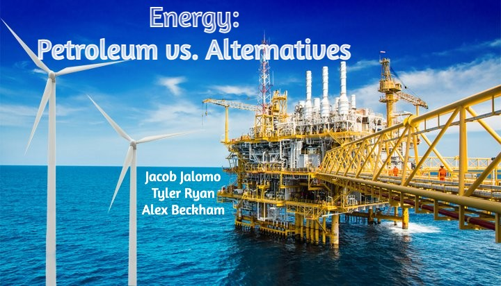
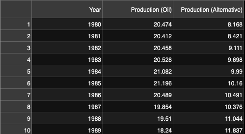
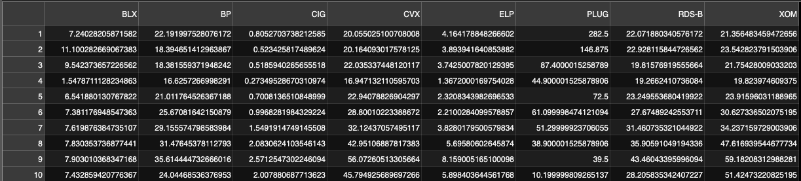
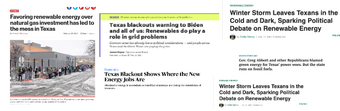

 # Title Slide 

       
---

# Motivation & Summary Slide

## The Oil & Gas industry can be very complex and confusing to understand. We wanted to explore how to best measure the health of this industry in today's world. 

 

## Our Questions

* How much energy is supplied by Oil & Gas vs Alternative energy sources? 
* What can the stock market tell us about the health of Oil & Gas?
* Does higher production mean higher stock returns? 

---
# Questions & Data

##Finding Data

  

---
# Data Cleanup & Exploration

## Production
* Read in csvs from EIA with total production for petroleum and total production for nuclear and renewables. 
* Dropped columns with excess information.
* Combined into one data frame

## Stocks
* Pulled stock price data from Yahoo Finance API:
  * Oil and Gas = BP, XOM, CVX, RDS-B
  * Alternative =  BLX, CIG, ELP, PLUG- These frequently show up in ETFs
* Created data frame with all tickers 

## Issues

* What data to use? What is alternative energy? 
  * Alternative energy consists of nuclear and carbon neutral sources like sunlight, wind, rain, tides, waves, and geothermal heat.
* Stocks- finding enough data. Funds did not go back far enough, so we used individual stocks.
* Date matching- alternative stock data only went back  went back to 2000
* Data had to be formatted by years because it came daily

---
# Data Analysis
## Questions Revisited

* How much energy is supplied by Oil & Gas vs Alternative energy sources? (Annual Production)
* What can the stock market tell us about the health of Oil & Gas? (Stock Returns & Stock Risks)
* Does higher production mean higher stock returns? (Correlations)

---
# Discussion
Discuss your findings. Did you find what you expected to find? If not, why not? What inferences or general conclusions can you draw from your analysis?

* Expectations: We expected that Oil and Gas Production would be lower than it was, given the talk about greener energy sources in the news. Instead, we can see that Oil & Gas production has spiked since 2011. 
* Findings:
  * Energy Production: 
  * Standard Deviation: Alternative Energy is more risky than Oil & Gas. 
  * Cumulative Returns: Alternative Energy returns have been higher than Oil & Gas in the last few years. 
  * Correlation: 

---
# Postmortem
* Discuss any difficulties that arose, and how you dealt with them.
* Discuss any additional questions that came up, but which you didn't have time to answer: What would you research next, if you had two more weeks?

Our original question was: Is the oil and gas industry a viable career path for a college graduate? Should young people who are involved in oil & gas course correct and find a new job? 
The problem with answering this specific question was that the project is based on historical data, and not future projections. (monte carlo simulation??)

We know that there are many more factors for measuring the health of the Oil & Gas Industry. In the future, we would take more factors into account, such as breaking down the uses for Petroleum products into more granular detail:
  * Transportation fuels
  * Fuel oils for heating and electricity generation
  * Asphalt and road oil
  * Feedstocks for chemicals, plastics, and synthetic materials 

  This would help us understand more of the reasons for why the numbers move in the way that they do. 

  We'd have to look at geopolitical events, natural disasters, price wars,

---
# Questions
* Open-floor Q&A with the audience
