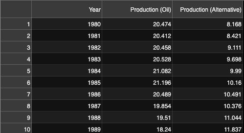

# Project 1

# Goal
In this project we compare the oil and gas industry with the Alternative Energy industry in terms of production and stock prices in order to evaluate which industry is the best performer.

# Measuring Sticks
### Assumptions:
Equilibrium between supply and demand exists and that production (supply) is at an equilibrium with consumption (demand).
    * Basically a higher production(supply) would mean that there is a higher demand for that product.

We decided to measure performance in a few different ways:

1) Rate of change in production:
    * Which industry is producing the most energy.
        * "Which industry has a higher demand?"
2) Rate of change in stock portfolios:
    * Which industry do investors have a better outlook on?
3) Standard deviation in rate of change of production.
    * "Which industry has the most stable supply?"
3) Standard deviation in rate of change of portfolio returns.
    * "Which industry has been more risky to invest in historically?"

## The Ideal Winner
The ideal winner would be the industry that is growing the fastest, has the best outlook in the eyes of investors, and has the lowest risk for each unit of growth.

# Our Findings

## Stock Analysis of Both Industries
### Cumulative Returns

Between 2000 and 2018 the cumulative returns of the oil and gas industry were superior. However, the alternative energy industry stocks spike higher than the oil and gas industry in around 2019. At face value it would seem as though investors had a better outlook on the alternative energy industry. However, when we looked at the stock prices again, we noticed an oddity. That is, PLUG and its skyrocketing stock price. We believe that this is the single factor behind the cumulative returns for the alternative energy portfolio being higher than those of the oil and gas.

### 5-Year Rolling Standard Deviation

Between the years 2004 and 2020, the alternative energy porftolio was newver lower than the oil and gas portfolio in regards to standard deviation. This means that in the past 16 years, the alternative industry has been the risker investment.

### Correlation

The correlation graph gives us a visual confirmation, though a misleading one, of our initial assumptions we made from the stock graph; both industries are positively correlated.

Interestingly enough though, when we ran the .corr() function on the same data that produced that graph, we found that these two stocks, in fact, have a negative correlation of 0.04.

This of course is the result of PLUG's stock price rocketing to the moon. This caused the entire alternative energy portfolio, which without PLUG was positively correlated with the oil and gas portfolio, to move sharply in the opposite direction. This is why the .corr() function shows us a negative correlation dispite the obvious positive correlation depicted from the graph.

## Stock Analysis Conclusion

The cumulative returns of the oil and gas industry from 2000 to 2019 were higher and their risk lower. This tells us that in terms of risk adjusted returns, the oil and gas industry has been superior to the alternative energy industry.

Energy production from both alternatives and oil & gas has trended upward since 1980. There was a slight dip in oil production during the recession years which would require a deeper analysis.
Production from alternatives and oil and gas has a very small positive correlation. This goes against my expectation that the two would be negatively correlated. A deeper analysis of this would need to include external influences.

## Production analysis of Both Industries
Energy production from both alternatives and oil & gas has trended upward since 1980. There was a slight dip in oil production during the recession years which would require a deeper analysis.

## Correlation
Production from alternatives and oil and gas has a very small positive correlation. This goes against my expectation that the two would be negatively correlated. A deeper analysis of this would need to include external influences.

# Conclusion

## Postmortem - A Deeper Dive

It's imporant to note that to truely capture the viability of the Oil & Gas industry, we have to consider these other uses of oil: 
  * Transportation fuels
  * Fuel oils for heating and electricity generation
  * Asphalt and road oil
  * Feedstocks for chemicals, plastics, and synthetic materials.

We would also consider the cost of producing Oil & Gas vs. Renewables.

We would also need to look at stock price fluctuation contributors such as geopolitical events, natural disasters, and price wars.

Total energy usage goes up naturally. We would take this into account, measuring how each type of energy moves with the total increase. 

Ultimately, this analysis is static. We are only looking at snapshot of the question. 