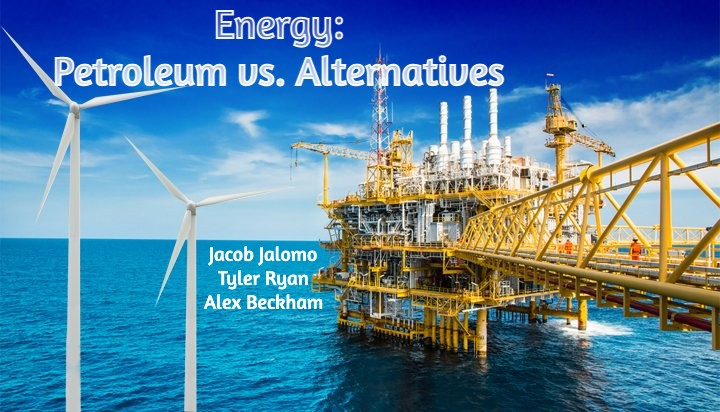

# Project 1

# Questions

## How much energy is supplied by Oil & Gas vs Alternative energy sources?
Of the total energy produced in the United States between 1980 and 2018, about 56% of energy was derived from petroleum and other petroleum related sources, while 44% of the energy was produced through alternative energy sources. Energy production from both alternatives and oil & gas has trended upward since 1980. There was a slight dip in oil production during the recession years which would require a deeper analysis. Production from alternatives and oil and gas has a very small positive correlation. This goes against my expectation that the two would be negatively correlated. A deeper analysis of this would need to include external influences.

## What can the stock market tell us about the health of the Oil & Gas Industry?  

The cumulative returns of the oil and gas industry from 2000 to 2019 were higher and their risk lower. This tells us that in terms of risk adjusted returns, the oil and gas industry has been superior to the alternative energy industry.

## Does higher production mean higher stock returns?
The data shows us that lower oil production corresponds with higher stock returns while alternative energy stock returns seem to stay constant regardless of the fluctuation in production. This goes against the assumption that higher production would lead to higher stock returns. Because of this, more in-depth analysis of external variables affecting stock returns is needed.

# Measuring Sticks
### Assumptions:
Equilibrium between supply and demand exists and that production (supply) is at an equilibrium with consumption (demand).
    * Basically a higher production(supply) would mean that there is a higher demand for that product.

We decided to measure performance in a few different ways:

1) Rate of change in production:
    * Which industry is producing the most energy.
        * "Which industry has a higher demand?"
2) Rate of change in stock portfolios:
    * Which industry do investors have a better outlook on?
3) Standard deviation in rate of change of production.
    * "Which industry has the most stable supply?"
3) Standard deviation in rate of change of portfolio returns.
    * "Which industry has been more risky to invest in historically?"

## The Ideal Winner
The ideal winner would be the industry that is growing the fastest, has the best outlook in the eyes of investors, and has the lowest risk for each unit of growth.

## Postmortem - A Deeper Dive

It's imporant to note that to truely capture the viability of the Oil & Gas industry, we have to consider these other uses of oil: 
  * Transportation fuels
  * Fuel oils for heating and electricity generation
  * Asphalt and road oil
  * Feedstocks for chemicals, plastics, and synthetic materials.

We would also consider the cost of producing Oil & Gas vs. Renewables.

We would also need to look at stock price fluctuation contributors such as geopolitical events, natural disasters, and price wars.

Total energy usage goes up naturally. We would take this into account, measuring how each type of energy moves with the total increase. 

Ultimately, this analysis is static. We are only looking at snapshot of the question. 